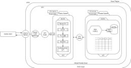
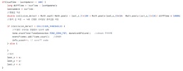
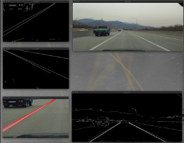
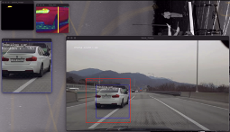
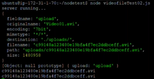
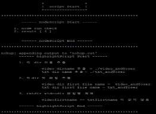
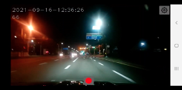


 
|
**객체 탐지를 응용한 안드로이드 블랙박스 어플리케이션**

김동현 심정수

한국산업기술대학교 컴퓨터공학과

{ simking95, dhkim0405 }@kpu.ac.kr

**Object detection-based Smartphone Dashcam**

Dong-Hyeon Kim Jeong-Su Sim

Dept. of Computer Engineering, Korea Polytechnic University

**요  약**

스마트폰을 블랙박스로 활용할 수 있도록 서비스하는 앱은 다수 존재한다. 스마트폰의 하드웨어 성능 은 꾸준히 증가하고 있으나, 해당 서비스들은 여전히 기본적인 블랙박스 기능만 제공하고 있다. Yolo, OpneCV와 같은 영상처리 기술의 발전과, 현재 시중에서 쉽게 구할 수 있는 스마트폰의 성능을 고려 하였 을때 스마트폰 블랙박스에 영상처리를 기반으로 한 주행보조 시스템을 구현할 수 있을 것으로 예상했다. 안드로이드 에서 수집된 영상을 서버에서 처리하지 않고 네이티브 환경에서 실시간으로 동작하는 기능을 구현하였다. 영상처리가 필요한 기능은 안드로이드 카메라로부터 수집된 영상의 프레임 단위작업을 수행함으로써 구현하였다. 블랙박스 기본기능에 포함되는 영상녹화, 충돌감지, 속도분석 등의 기능은 안드로이드 프레임워크 에서 지원하는 검증된 API를 사용하여 구현하였다. 네이티브 환경에서 제약이 따르는 기능은 API 서버를 구축하여 해결하였다. 영상데이터와 더불어 주행 데이터는 비동기식으로 서버로 전송되고 서버 내 동작 중인 배치프로그램이 하이라이트 영상 추출, 데이터베이스 삽입, 파일 관리를 수행한다. 본 논문에서 다루는 애플리케이션은 블랙박스 기본기능과 주행보조를 탑재 함으로써 하나의 앱으로 두 가지 핵심기능을 지원하는 목표를 달성했다.

|
| :-: |

**1. 서론**

한 조사기관에 따르면 블랙박스의 설치율이 불과 수년 새 50%의 증가율을 보였다. 이처럼 블랙박스의 필요성이 증가하고 있는 가운데 여전히 설치하지 않은 차량이 약 240만대 존재하며, 이에 대한 원인으로 비용, 설치 과정의 부담 등이 있었다. 스마트폰을 블랙박스로 활용함으로써 해당 문제를 해결하고 블랙박스 사용성을 높이고자 했다. 모바일 기기의 발전에의해 스마트폰에서도 영상처리 기능을 수행할 수 있을 것으로 예상했다. 이에 블랙박스 기본 기능은 물론 스마트폰에서 주행보조 기능으로써 차선 인식, 거리 감지 등의 실시간 서비스를 제공하고 API 서버와 연동 함으로써 주행 데이터를 기반으로 한 하이라이트 추출기능을 수행하도록 하였다.

**2. 관련 연구**

**2.1 기존 유사 앱과의 비교**

<표1> 유사 어플리케이션과의 비교

위의 표 1에서는 유사 애플리케이션과 어떠한 차이가 나는지를 보여주고 있다. 현재 시중에서 판매 중인 블랙박스의 경우 약 수 십 만원 상당의 비용을 지불 해야 한다. 현재 출시되어있는 블랙박스 App들의 경우 주행속도, 충격 감지, 녹화 화질 선택 등 기본적인 기능만 제공하고 있다. 또한, 사고 영상, 공익 신고 영상을 위해 필요 영상을 찾아 내어 추출하는 번거로운 과정을 감수해야 하고, 영상처리를 통한 주행 보조 등 부가적인 서비스는 지원하지 않는다. 본 논문에서 개발한 블랙박스 어플은 다음과 같은 점을 개선하고자 했다. 첫째, 스마트폰을 블랙박스로 활용함으로써 블랙박스 사용을 위해 부담해야 하는 비용 문제를 해결한다. 둘째, 블랙박스 앱의 기본기능에서 나아가 영상처리를 통해 부가적인 알림 기능들을 제공하여 운전자의 안전주행을 유도한다. 셋째, 하이 라이트추출 기능을 탑재 함으로써 영상 추출의 번거로운 과정을 해결 한다.

**3. 세부 설계 및 구현**

**3.1 개발환경**

본 논문의 개발 환경중 서버 환경은 다음과 같다. Amazon EC2 - Ubuntu 20.04.2.0 LTS(Focal Fossa) 에서 API서버를 Node.js(v14.16.0)기반으로 구축하였고 DataBase로는 MySql 8.0.27 버전을 사용하였다. 영상처리 모듈 개발은 Mac OS 10.15.7 (Catalina)에서 Xcode로 개발 하였으며, JDK 1.8과 Android SDK를 사용 하였다. 테스트에 사용된 단말기는 삼성전자 Galaxy s10e (Android Q 10.0)이다.

**3.2 시스템 구성**

(그림 1) 시스템 구성도

이 어플리케이션의 기본적인 동작 방식은 Android Application 에서 수집한 영상 데이터를 기반으로  실시간 영상처리를 수행하며, 영상데이터와 더불어 주행 데이터는 지정된 시간에 맞춰 서버로 전송된다. 서버로 업로드 된 데이터들은 배치프로그램에 의해 하이라이트가 추출되어 각 카테고리에 맞는 폴더로 이동하게 된다. 이 모든 송,수신 은 DB에 삽입된 파일명으로 관리되어 진다.

**4. 구현 및 결과**

**4.1 안드로이드 환경 구현**

**4.1.1 OpenCV 카메라**

블랙박스의 기본기능을 수행하기 위해서는 영상 정보를 수집할 수 있어야 한다. 카메라는 Android 스마트폰의 내장된 카메라를 사용하였다. 그리고 영상녹화 방법으로 구글에서는 MediaRecorder API를 사용할 것을 권장한다. 그러나 해당 API는 영상의 프레임 단위 작업을 지원하지 않아 차선 검출, 차량 탐지등 실시간 영상처리를 수행할 수 없고 충돌정보와 차선 변경 차량에 대한 하이라이트 영상을 추출할 수 없다. 이러한 문제를 해결하기 위해 OpenCV에서 지원하는 카메라 를 사용해 영상정보를 수집하고 VideoWriter클래스를 사용해 영상정보를 녹화했다. 그리고 실시간 영상처리 기능은 NDK(Native Development Kit)을 사용해 Android에서 C++코드로 구현하였다.

**4.1.2 충돌 감지**

(그림2) 충돌감지 알고리즘

위 사진은 충돌 정보를 기반으로 알림을 주는 알고리즘이다. 블랙박스에서 영상처리를 수행하기에 앞서 우리는 블랙박스 기 본 기능을 구현하는 것에도 시간을 많이 투자했다. 기존 블랙 박스들 에서 사용된 운영체제와 달리 안드로이드 OS는 개방 플랫폼을 지원해 개발에 추가적인 비용 없이 검증된 라이브러리를 사용해 충돌 값을 도출해 낼 수 있었다. 본 논문에서 구현한 애플리케이션에서는 안드로이드 내장 삼축 가속도 센서를 이용해 센서의 변화량을 계산해 값을 도출해내고 비동기 식으로 동작하는 영상 프레임에 맞는 충돌 값을 저장하여 높은 충돌 값에 대한 영상을 추출할 수 있었다.

**4.1.3 차선 이탈 방지(직선 검출)**

(그림 3) 직선 검출

위 그림 3은 안드로이드 내장 카메라를 통해 수집한 영상정보를 기반으로 직선을 검출하는 과정을 보이고 있다. 출력 영상의 각 영상을 gray scale 처리하고 각 픽셀의 밝기를 일정한 기준치에 의해 흑, 백 두개의 값으로 출력했다. 결과로 얻은 잡음이 제거된 영상을 기반으로 엣지 검출 알고리즘을 적용했다. 본 논문에서는 Canny 알고리즘을 적용했다. 전처리 결과로 얻은 영상정보에 허프변환(Hough Transform)을 적용해 직선을 검출할 수 있었다. 허프 변환은 한 평면 위 점들의 집합 중에서 일정한 조건을 만족시키는 직선을 찾는 방법이다. 실제 도로 상황을 영상으로 수집할 경우 많은 예외 상황이 발생한다. 영상의 화질, 날씨, 조명 등의 외부 요소로 인해 엣지의 끊어짐, 밝기의 불연속 등 문제가 발생한다. 문제를 해결하기 위해 더 많은 엣지를 검출하도록 알고리즘을 변경하였다. 그리고 허프 변환을 통해 검출된 많은 직선들 중 가장 차선에 가까운 직선을 추출하기 위해 직선의 각도를 계산해 가장 차선과 가까운 각도를 가진 직선을 남겨 다양한 도로 환경에서 차선을 추출하였다.

**4.1.4 진로 변경 위반 감지(객체 탐지 및 차량 트래킹)**

(그림 4) 차량 트래킹

그림4는 트래킹 중인 차량의 방향지시등과 이동 경로를 파악하여 차선 변경 여부를 검사하는 과정을 보이고 있다. 주행중인 차선으로 차선 변경을 시도하는 차량을 트래킹 하기 위해 OpenCV에서 지원하는 Tracker 중 CSRT를 사용했다. 그리고 런타임 중 트래킹을 수행할 객체를 선별하기 위해 Cascade Classifier를 사용했다. CSRT는 정확도는 높지만 느린 FPS 성능을 가진 트래커로 객체 탐지의 결과를 그대로 모두 반영하여 트래킹을 시도할 경우 성능 저하를 야기 했다. 그래서 차선 변경을 시도할 확률이 가장 높은 차량을 선별하여 트래킹을 시도하도록 하였다. 동시에 영상의 프레임당 차량 탐지를 수행하여 차선 변경을 시도할 확률이 더 높은 차량이 탐지될 경우 트래킹 객체를 변경하도록 하였다. 차량 트래킹 수행 중에는 차량의 이동경로를 저장해 경로를 분석하여 해당 차량이 주행 중인 차선으로 진입했는지 여부를 판단하였다. 또한, 방향 지시등을 점등하지 않은 차량에 대한 하이라이트 영상을 추출하기 위해 방향지시등 점등 여부 또한 검사하였다. 방향지시등은 특정 색상(노란색)영역의 범위를 지정해 해당 범위 내 분포된 색상의 전체 화면대비 비율을 계산하여 방향지시등 점등 여부를 판단하였다.

**4.2 통신 환경 구현**

**4.2.1 Retrofit2 기술을 이용한 Android api 서버 통신(파일 전송)**

(그림 5) Android – Server 파일 전송

Android Application에서 백 앤드 서버와 HTTP 통신하기 위해서는 통신 라이브러리를 사용해야 한다. 자바를 활용한다면 별도의 라이브러리를 활용할 필요 없이 Java.net에 내장되어 있는 HttpURLConnection을 사용하면 되지만 연결, 캐싱, 실패한 요청을 재시도, Threading, 응답 분석, 오류 처리 등 고려해야 할 것 들이 많기 때문에 효율적인 유지/보수를 위해 HttpClient 라이브러리를 사용하였다. 여러 라이브러리들이 존재하지만 성능면에서 우수한 Retrofit 라이브러리를 채택하였다. 이는 Rest 기반의 웹서비스를 통해 JSON 구조의 데이터를 쉽게 가져오고 업로드할 수 있다. Android Application을 네트워크에 연결하기 위해 인터페이스를 이용하여 Service 객체를 획득 한 후 네트워킹이 필요할 때 Call 객체를 획득하여 이용한다.본 논문에서는 binary file(video) 전송을 위해 body에 part 형식으로 데이터를 담고, HTTP method로는 Multipart 어노테이션을 사용해 서버 측으로 전송하였다. JSON 데이터를 GsonConverter가 자동으로 VO 객체를 생성하기 위해서 Model 클래스를 정의하였다. 서버와 통신할 데이터 타입에 맞는 컨버터를 GsonConverterFactory로 지정하였기 때문에 JSON 데이터를 Gson 라이브러리로 파싱하고 그 데이터를 Model에 자동으로 담아준다. 직접적인 네트워킹 시도를 위해 Call 객체의 함수를 호출하면서 Callback 클래스의 객체를 매개변수로 지정하면 네트워킹을 시도하고 서버에서 정상적으로 결과를 받았을 때와 서버 연동에 실패했을 때 동작할 함수를 지정할 수 있다.

**4.2.2 Retrofit2 기술을 이용한 Android api 서버 통신 (파일 수신)**

파일 전송 기술과 마찬가지로 retrofit2 라이브러리를 사용한다. 파일 전송부와 기술적으로 다른 부분은 인터페이스 구현 시 Multipart 어노테이션이 아닌 Streaming 어노테이션을 사용한다는 것이다. 파일 다운로드를 위해 GET 어노테이션 상단에 Streaming 어노테이션 주석을 사용한다. 그렇지 않으면 Retrofit이 전체 파일을 메모리로 이동한다. Streaming 어노테이션 을 사용하면 현재 메모리를 소모하지 않고 바이트에 액세스할 수 있다. Streaming 어노테이션 을 사용할 때 다운로드한 데이터를 쓰는 코드를 별도의 스레드에 추가해야 한다. enqueue 메소드를 사용하여 요청을 시작할 수 있다. 그 안에 AsyncTask를 만들거나 Rxjava를 사용해야 한다. 본 논문에서는 AsyncTask를 사용하였다.

**4.3 서버 환경 구현**

**4.3.1 Node.js API서버 구현 및  Android 통신**

API 서버로 AWS\_EC2 Ubuntu 환경에서 Non-blocking I/O와 단일 스레드 이벤트 루프를 통한 높은 처리 성능을 가지고 있는 node.js javascript 런타임 프로그램을 사용하였다. Node.js 서버 구축을 위한 웹 프레임 워크인 express 모듈을 사용 하여 효율적인 서버 구현이 가능하게 하였다. GET방식의 통신은 url에 데이터 소스가 유출되기 때문에 POST method 를 사용하였다. Android Application에서 접속하는 서버의 주소는 예측 불가한 서버 IP의 변경에 대비하기 위해 서버 DNS 주소로 접근하는 방식을 채택하였다. Express 모듈은 Android Application과 HTTP 통신만 가능할 뿐 요청받은 데이터를 서버에 업로드 할 수 없다. 이에 Android Application에서 전달받은 multipart/form-data를 다루는 node.js의 미들웨어인 multer 모듈을 사용 하였다. 전달받은 주행 데이터와 주행 영상을 분류한 뒤 Stroage 모듈을 사용해 각 파일별로 추출하는 과정을 거친다.

**4.3.2 추출 영상 관리**

(그림 6) 배치 프로그램

추출된 하이라이트 영상은 client가 언제든 요청 할 수 있도록 전 과정을 스크립트 배치 프로그램을 이용하여 자동화 작업을 수행한다. 자동화 스크립트는 nohup 프로그램을 통해 데몬 형태로 실행되며 터미널이 끊기더라도 실행을 멈추지 않고 동작한다. Android Application 에서 전달받은 주행 데이터와 주행 영상을 기반으로 파일이 매치하는지 분석한 뒤 충돌, 끼어들기 등의 하이라이트를 추출하게 된다. 이렇게 추출된 영상들의 정보는 DB에 입력되며 모든 영상의 업로드 및 삭제는 DB를 통해 이루어지게 된다. 이렇게 추출된 하이라이트들은 client가 요청 시 언제든 파일 송신이 가능하다.

**4.4 구현결과**

(그림7) App 실행 화면

위 그림 7은 본 논문에서 다루는 애플리케이션의 실제 구동 영상의 일부이다. 실제 구동 결과 개발 초기에 계획했던 대부분의 기능이 기대 이상의 성능을 보여주었다.

직선 검출에 의한 차선 인식은 영상 프레임의 수준이 일정히 유지 된다는 가정하에 실제 양산 중인 차량에 탑재된 차선 이탈 보조 기능과 유사한 성능을 보여주었다. 충돌 센서의 경우 실제 판매 중인 약 60만원 가량의 블랙박스와 유사한 성능을 보여주었다. 진로 변경 위반 모듈의 경우 비교 대상이 없어 객관적 성능 판단은 어려우나 Tracker의 성능이 좋은 수준을 유지하면 고속도로 환경에서는 정상적으로 동작하는 것을 확인했다. 클라이언트와 서버 간 통신에서 개발 초기에 겪어야 했던 비동기식 통신과 서버 내 파일 동기화에 대한 문제는 서버내 배치프로그램을 동작시켜 해결하였다. 다수의 트래픽을 수용할 만한 서버가 준비되지 않아 동시 접속자에 대한 테스트를 수행 하지는 못했으나 서버증축이 이루어진다면 다수의 사용자에게 서비스를 제공할 수 있을것으로 기대해 본다.

**5. 결론 및 향후 연구과제**

본 논문에서 다루는 애플리케이션은 모바일 Native 환경에서 영상처리 기능을 제공한다. 현재 블랙박스 애플리케이션은 다수 존재하나, 부가적인 서비스를 제공하는 앱은 많지 않으며, 영상처리와 같은 무거운 작업을 수행하는 블랙박스는 더더욱 찾아보기 어렵다. 앞서 말한 바와 같이 영상처리 기능을 Native 환경에서 구현하는 것이 모바일 기기의 성능에 영향을 주는 것을 많이 경험해 볼 수 있었다. 그러나 모바일 디바이스의 성능은 큰 폭으로 발전하고 있으며, 현재 수준의 기기들로도 차선검출과 같은 기능은 충분히 수행할 수 있는 정도이다. 이러한 기능은 최신 자동차를 소유하고 있지 않은 운전자들에게 주행 보조 시스템이라는 경험을 제공해 줄 수 있을 것으로 기대한다. 아쉽게도 다수의 트래픽을 수용할 만한 서버가 준비되어있지 않지만, 영상처리에서의 성능 부하 문제를 잘 해결한다면 API 서버 없이 앱 마켓에도 출시 해 볼만 하다고 기대해 볼 수 있다.

**참고문헌**

**[1] retrofit**

**https://square.github.io/retrofit/**

**[2] express**

**https://expressjs.com/ko/4x/api.html**

**[3] AWS\_EC2**

**https://docs.aws.amazon.com/ec2/index.html?nc2=h\_ql\_doc\_ec2**

**[4] Amazon\_RDS**

**https://docs.aws.amazon.com/rds/index.html?nc2=h\_ql\_doc\_rds**

**[5] mysql**

**https://dev.mysql.com**

**[6] 황선규 지음, Opencv 4로 배우는 컴퓨터 비전과 머신러닝, 2019년**

**[7] Straight Line Detection Using PCA and Hough Transform, 오정수, 한국정보통신학회논문지\_Vol.22.No.2:227-232, Feb 2018**

**[8] Flower Recognition System Using OpenCV on Android Platform, 조우 지음 , 전남대학교 도서관(여수 캠퍼스) , 2017**

**[9] Android developers documantation**

**[10] pyimagesearch**

**https://www.pyimagesearch.com/2018/07/23/simple-object-tracking-with-opencv/**
